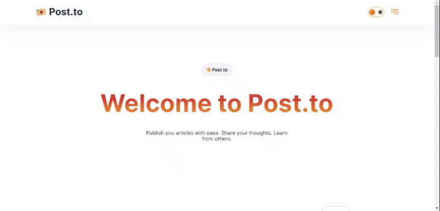

To view deployed [Post.to](https://post-to.vercel.app/) site,
visit **post-to.vercel.app**

## How I worked on this project

My goal is to simulate professional work environment.

- I built this app based on Figma design: [Screenshot of designs](docs/figma.JPG)
- I worked on the tasks based on kanban board: [Screenshot of tasks](docs/kanban.JPG)
- I used feature branches and Pull Requests: [Example PR](https://github.com/cathleys/post.to/pull/15)

## How to navigate this project

- Somewhat complex application logic: [Example code](https://github.com/cathleys/post.to/commit/4a29cd08447fc22a1d2c0d2ef7faf05b61f4b445)
- Responsive CSS using styled components: [Example code](https://github.com/cathleys/post.to/pull/9/files)
- This app has API calls: [Example data request](https://github.com/cathleys/post.to/blob/49c4aa0b3962cc8dbb66fe65a718beba61ab8fc6/pages/api/auth/login.ts#L1) and [data transformation](https://github.com/cathleys/post.to/blob/49c4aa0b3962cc8dbb66fe65a718beba61ab8fc6/features/login/components/login.tsx#L4)
- Integrates Storybook to test isolated components: [Example gif](docs/sb.gif)
- CI/CD pipeline set up: [Screenshot of CI/CD](docs/ci.JPG)

## Why I built the project this way

- In a nutshell, the tech stack used in this app are widely supported by majority of developers according to this [article](https://profy.dev/article/react-tech-stack).

- styled-components is a react-specific CSS-in-JS styling solution that helps me to design with a custom css style and a bit of Material UI to build components faster.

- Storybook is a great tool to isolate certain react component to test its different states and UI design. Needless to say, it helps me to focus on documenting the component..

- Typescript helps to check javascript. This allows me to reduce bugs and errors in the code and make sure that the values are type safe.

- I made this project full stack to showcase my dev skill, but I'm focused on Frontend/React development since it's something I'm interested in at the moment.

- Whenever I get stuck on a certain task, I usually reach out for help to essentially solve the problem and learn from their experience. I think I need to mention this since I'm a human and actively learning. I can't improve this app without their existence.

## If I had more time I would change this

- Separate some code to its respective files like API logic.
- Refactor some of the code: Especially this [part](https://github.com/cathleys/post.to/blob/49c4aa0b3962cc8dbb66fe65a718beba61ab8fc6/features/setting-page/components/settings.tsx#L24) AND this [part](https://github.com/cathleys/post.to/blob/49c4aa0b3962cc8dbb66fe65a718beba61ab8fc6/features/ui/comments/comment-list/comment-list.tsx#L48) which I would like to add optimistic updates.
- Cover with testing
- Add more features, such as search functionality,categories,like button etc.

## The Application

The application is a full stack production-level,user-friendly blog app, where you can posts your blogs easily.

**Note: If you are an Interviewer,** simply click the demo user access link on the login or sign up page and you can access the app. Do not change the password and username please. Thank you!



## Getting Started

This project is built with Next.js, TypeScript, Storybook, styled-components among others. To start working on the project, first clone the repository and install the dependencies.

```bash
npm install
```

Then run the development server:

```bash
npm run dev
```

Now you can open [http://localhost:3000](http://localhost:3000) with your browser to see the application.

## Learn More

To learn more about Next.js, take a look at the following resources:

- [Next.js Documentation](https://nextjs.org/docs) - learn about Next.js features and API.
- [Learn Next.js](https://nextjs.org/learn) - an interactive Next.js tutorial.

You can check out [the Next.js GitHub repository](https://github.com/vercel/next.js/) - your feedback and contributions are welcome!

## Deploy on Vercel

The easiest way to deploy your Next.js app is to use the [Vercel Platform](https://vercel.com/new?utm_medium=default-template&filter=next.js&utm_source=create-next-app&utm_campaign=create-next-app-readme) from the creators of Next.js.

Check out our [Next.js deployment documentation](https://nextjs.org/docs/deployment) for more details.
